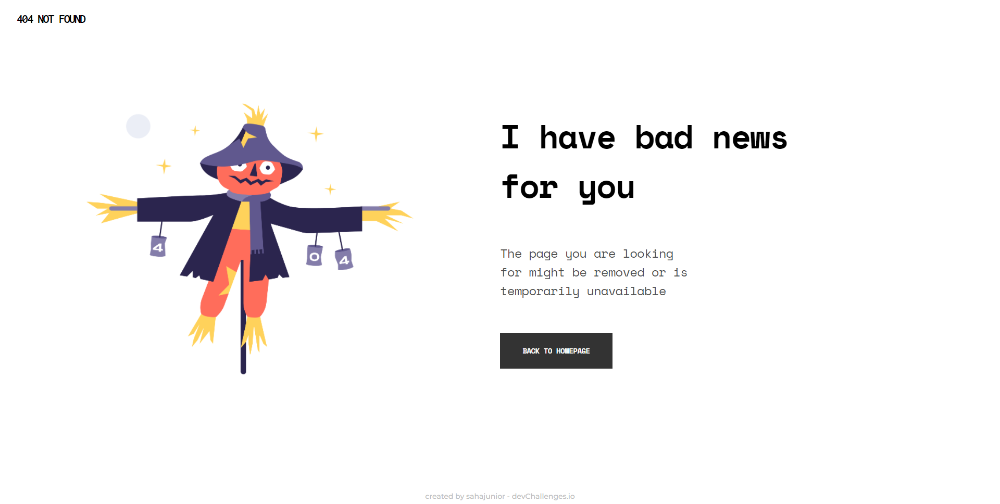
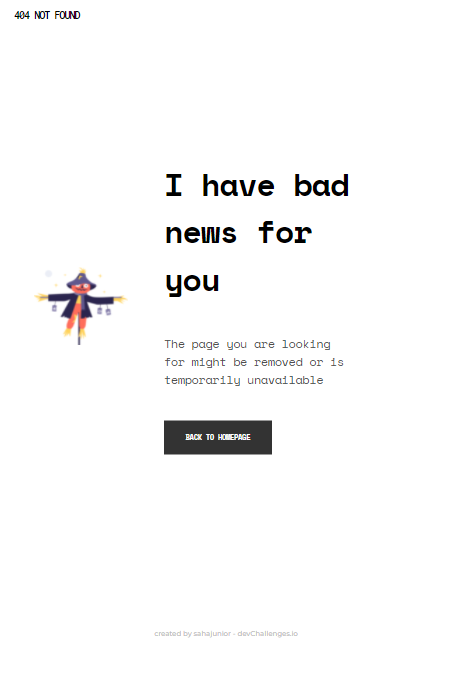
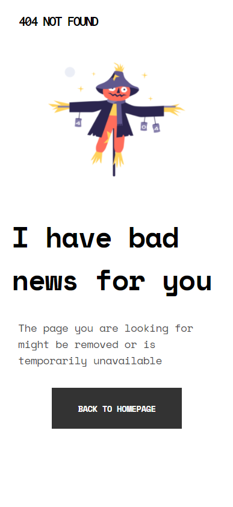

<h1 align="center">404 Page Error</h1>

   Solution for a challenge from  <a href="http://devchallenges.io" target="_blank">Devchallenges.io</a>.

  <h3>
    <a href="https://error-404-sahajunior.netlify.app/" target="_blank">
      Demo
    </a>
     | 
    <a href="https://devchallenges.io/solutions/YXUjoHdw44tm9ZO9yyyX" target="_blank">
      Solution
    </a>
     | 
    <a href="https://devchallenges.io/challenges/wBunSb7FPrIepJZAg0sY" target="_blank">
      Challenge
    </a>
  </h3>

## Table of Contents

- [Overview](#overview)
  - [Screenshots](#screenshots)
  - [Built With](#built-with)
- [Features](#features)
- [Contact](#contact)

## Overview

Introducing Project:

- It was a fantastic experience to work with a subtle web page.
- I have earned the knowledge of CSS markup.

### Screenshots

| Desktop View (Width: 1280px)                             | Tablet View (Width: 912px)                                     | Mobile View (Width: 390px)                                     |
| -------------------------------------------------------- | -------------------------------------------------------------- | -------------------------------------------------------------- |
|  |  |  |

### Built With

- [HTML](https://html.com/)
- [CSS](https://developer.mozilla.org/en-US/docs/Web/CSS)

## Features

This application/site was created as a submission to a [DevChallenges](https://devchallenges.io/challenges) challenge. The [challenge](https://devchallenges.io/challenges/wBunSb7FPrIepJZAg0sY) was to build an application to complete the given user stories.

## Contact

- GitHub [@sahajunior](https://github.com/sahajunior)
- Twitter [@_saha_junior_](https://twitter.com/_saha_junior_)
- Instagram [@_saha_junior_](https://instagram.com/_saha_junior_)
